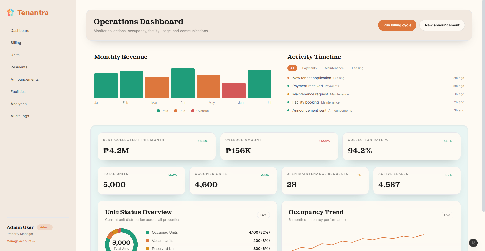

# 🏢 Tenantra

**Tenantra** is a comprehensive condominium and apartment management platform built with modern web technologies. It provides property managers with powerful tools for billing, unit management, resident communications, facilities booking, and operational analytics.



### 🚀 Features

#### **Core Management**

- **Dashboard** - Real-time overview of collections, occupancy, and operational metrics
- **Billing Management** - Automated billing cycles, invoice generation, and payment tracking
- **Units Management** - Complete inventory tracking with status monitoring
- **Residents Management** - Tenant information, lease tracking, and communication tools

#### **Operations**

- **Announcements** - Targeted communications to residents and buildings
- **Facilities Booking** - Amenity reservations with approval workflows
- **Analytics & Insights** - Financial and operational performance metrics
- **Audit Logs** - Complete activity tracking for security and compliance

#### **Design & UX**

- **Modern Interface** - Clean, professional design with Tailwind CSS
- **Responsive Layout** - Optimized for desktop and tablet viewing
- **Custom Components** - Reusable UI components with consistent styling
- **Accessibility** - WCAG compliant with keyboard navigation support

### 🧰 Tech Stack

- **Frontend**: Next.js 15 (App Router), TypeScript, Tailwind CSS
- **UI Components**: Custom component library with ShadCN-inspired patterns
- **Styling**: CSS custom properties for theming and consistency
- **Development**: ESLint, TypeScript strict mode, modern tooling

### 💻 Getting Started

```bash
git clone https://github.com/yourusername/tenantra.git
cd tenantra
npm install
npm run dev
```

Open [http://localhost:3002](http://localhost:3002) to view the application.

### � Project Structure

```
├── app/                    # Next.js app directory
│   ├── (admin)/           # Admin dashboard routes
│   │   ├── billing/       # Billing management
│   │   ├── units/         # Unit inventory
│   │   ├── residents/     # Tenant management
│   │   ├── announcements/ # Communications
│   │   ├── facilities/    # Amenity bookings
│   │   ├── analytics/     # Performance insights
│   │   └── audit-logs/    # Activity tracking
│   ├── globals.css        # Global styles and theme
│   └── layout.tsx         # Root layout with sidebar
├── components/            # Reusable UI components
│   └── ui/               # Base component library
├── public/               # Static assets
├── tailwind.config.cjs   # Tailwind configuration
└── globals.css          # Theme variables and base styles
```

### 🎨 Design System

- **Color Palette**: Warm, professional theme with accent colors
- **Typography**: Valera Round for branding, system fonts for content
- **Components**: Consistent design patterns with hover states and transitions
- **Layout**: Fixed sidebar navigation with responsive main content

### 📊 Admin Pages

1. **Dashboard** - Operations overview with KPIs and activity timeline
2. **Billing** - Invoice management, collections, and payment tracking
3. **Units** - Property inventory with status and tenant information
4. **Residents** - Tenant management with lease and communication tools
5. **Announcements** - Targeted messaging and communication history
6. **Facilities** - Amenity booking system and maintenance tracking
7. **Analytics** - Financial insights and operational metrics
8. **Audit Logs** - System activity and security monitoring

### � Development

```bash
# Development
npm run dev

# Type checking
npm run typecheck

# Linting
npm run lint

# Production build
npm run build
npm run start
```

### 🔧 Customization

- **Theme**: Modify CSS custom properties in `globals.css`
- **Components**: Extend UI components in `components/ui/`
- **Layout**: Adjust sidebar and navigation in `app/(admin)/layout.tsx`
- **Styling**: Update Tailwind config for design tokens

### 📱 Browser Support

- Chrome 90+
- Firefox 88+
- Safari 14+
- Edge 90+

### 📄 License

MIT License - see LICENSE file for details.
